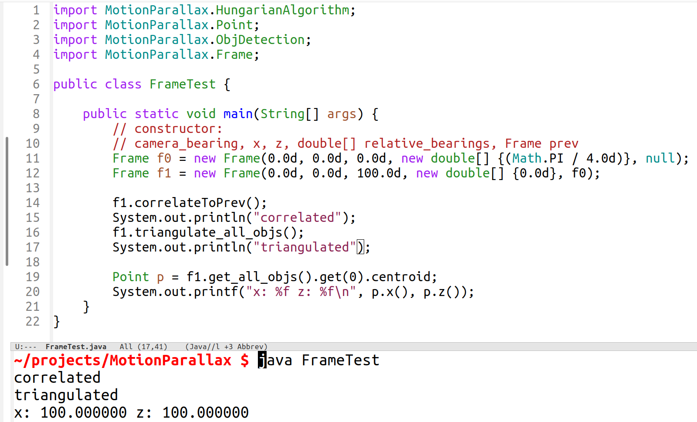
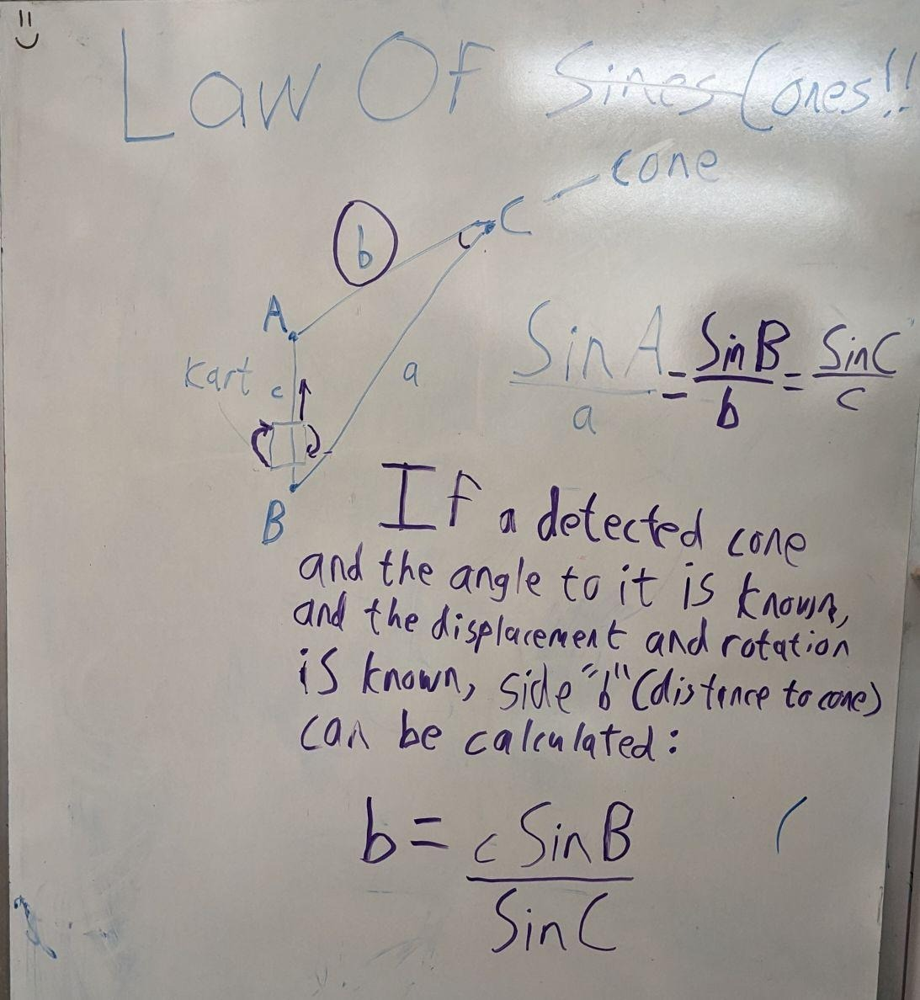
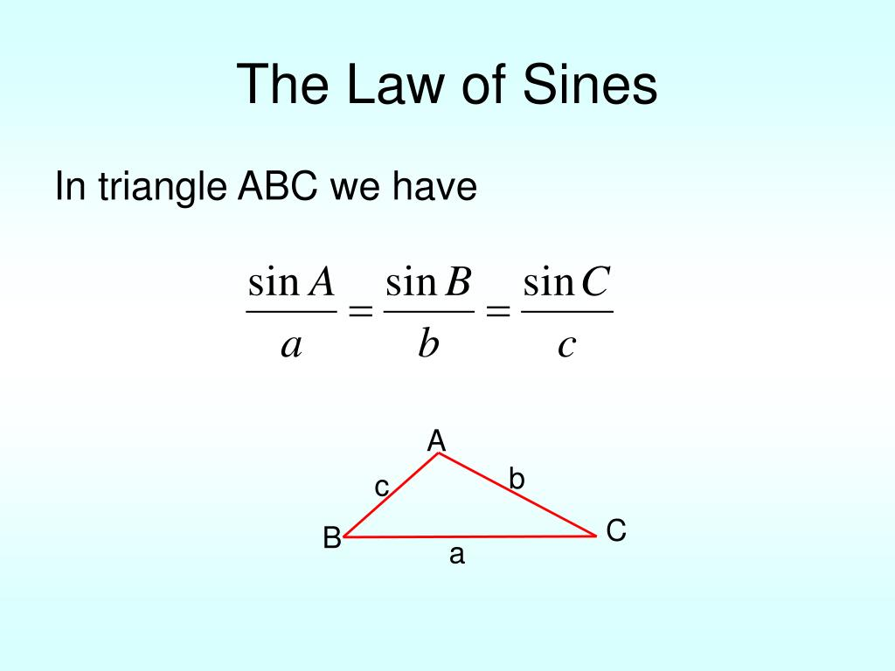

# MotionParallax

A camera-only technique to correlate and determine distance to landmarks over time as the camera vehicle is moving.

Originally created for use by the [KSU EVT](ksuevt.org) undergraduate student competition team

cpp code by Sahan Reddy and Ethan Leitner

## Motivation

After substantial testing with an [OAK-D Pro](https://shop.luxonis.com/products/oak-d-pro) camera, we found that its stereoscopic depth values were wildly inaccurate past distances of about 10ft. This is likely because the distance between the two stereoscopic cameras is so small that it is negligible at longer distances.

We would like to be able to determine the distance to landmarks at further distances.

While it is difficult to determine accurate depth, the location of the bounding box for landmark(s) in the picture frame (generated by YOLOv7 object detection ML) may provide a very accurate angle measure of the landmark's bearing relative to the camera.

This repo describes an theoretical technique to determine the distance to a landmark using just:

  * the change in location and orientation of our camera
  * the change in its bearing to a landmark.

...to triangulate the distance to the landmark, in a process called **MotionParallax**

In addition, this technique employs an accurate algorithm to correlate landmark instances from one frame to the next. This may be useful for de-duplication of landmark instances which are detected multiple times.

## Premise

If a detected cone and the angle to it is known, and the displacement and rotation between camera frames is known, side "b" (distance to cone) can be calculated using the [law of sines](https://www.math.net/law-of-sines):

### Steps

1. Find the bearing to landmarks in the current picture frame

2. Let the vehicle travel some distance, keeping track of its displacement and rotation

3. Find the bearing to the landmarks in the current picture frame again, and compare it to previous frame(s)

4. Use an [assignment algorithm](https://en.wikipedia.org/wiki/Hungarian_algorithm) to correlate landmarks in the current frame to those in the previous frame. Do not attempt to make a correlation for landmarks whose change in bearing exceeds a specified threshold `T1`

5. For every landmark in the current frame, where possible search backwards in time for a given landmark until the change in the **reverse bearing** (from the landmark to the vehicle) is sufficiently-large to perform triangulation. Using the threshold `T2` and change in bearing `C`, abs(`C`) ≥ `T2`. For landmarks for which no sufficient data is present, treat it as a newly-discovered landmark and do not attempt to calculate its distance.

6. Use the law of sines to triangulate the location of a given landmark in the current frame. To calculate this distance `b` (in meters) using the camera's displacement `c` (in meters), the change in bearing from the cart to the landmark `B`, and the change in bearing from the landmark to the vehicle `C`:

**b = c\*Sin(B) ÷ Sin(C)**
