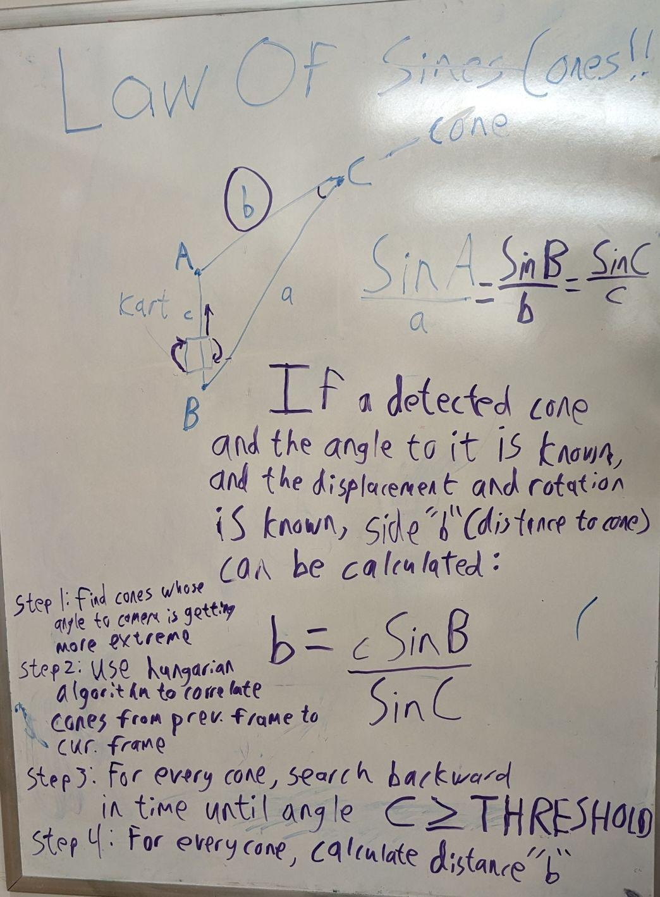
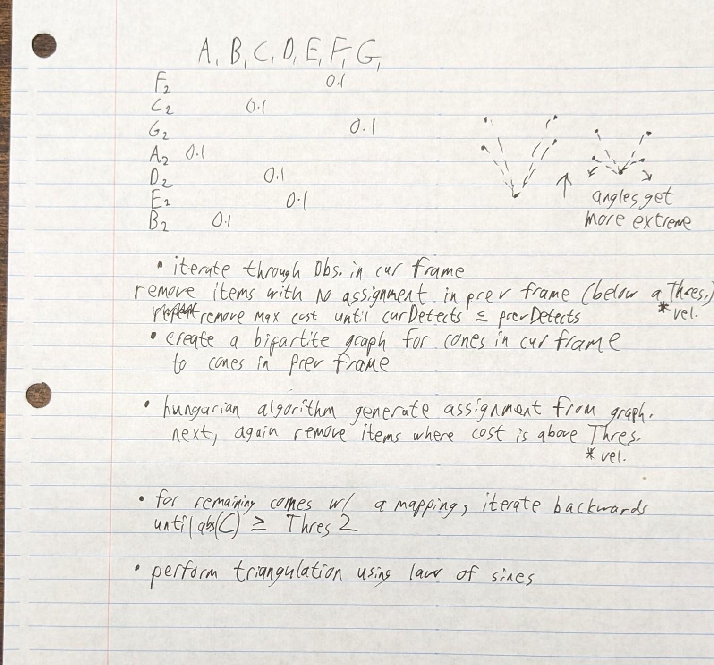

# MotionParallax

A camera-only technique to determine distance to landmarks as the vehicle is moving.

## Motivation

After substantial testing with the OAK-D Pro camera, we found that its stereoscopic depth values were wildly inaccurate past distances of about 10ft. This is likely because the distance between the two stereoscopic cameras is so small that it is negligible at such distances.

We would like to be able to determine the distance to landmarks at further distances.

While it is difficult to determine accurate depth, the location of the bounding box for the landmark in the picture frame may provide a very accurate angle measure of the landmark's bearing relative to the camera.

This repo describes an theoretical technique to determine the distance to a landmark using just:

  * the change in location and orientation of our camera
  * the change in its bearing to a landmark.

...to triangulate the distance to the landmark, in a process called **MotionParallax**

## Premise

If a detected cone and the angle to it is known, and the displacement and rotation between camera frames is known, side "b" (distance to cone) can be calculated using the [law of sines](https://www.math.net/law-of-sines):

### Steps

1. Find the bearing to cones in the current picture frame

2. Let the kart travel some distance, keeping track of its displacement and rotation

3. Find the bearing to the cones in the current picture frame again, and compare it to previous frame(s)

4. Use an [assignment algorithm](https://en.wikipedia.org/wiki/Hungarian_algorithm) to correlate cones in the current frame to those in the previous frame. Do not attempt to make a correlation for cones whose change in bearing exceeds a specified threshold `T1`

5. For every cone in the current frame, where possible search backwards in time for a given cone until the change in the **reverse bearing** (from the cone to the kart) is sufficiently-large to perform triangulation. Using the threshold `T2` and change in bearing `C`, abs(`C`) ≥ `T2`. For cones for which no sufficient data is present, treat it as a newly-discovered cone and do not attempt to calculate its distance.

6. Use the law of sines to triangulate the location of a given cone in the current frame. To calculate this distance `b` (in meters) using the camera's displacement `c` (in meters), the change in bearing from the cart to the cone `B`, and the change in bearing from the cone to the kart `C`:

**b = c\*Sin(B) ÷ Sin(C)**
